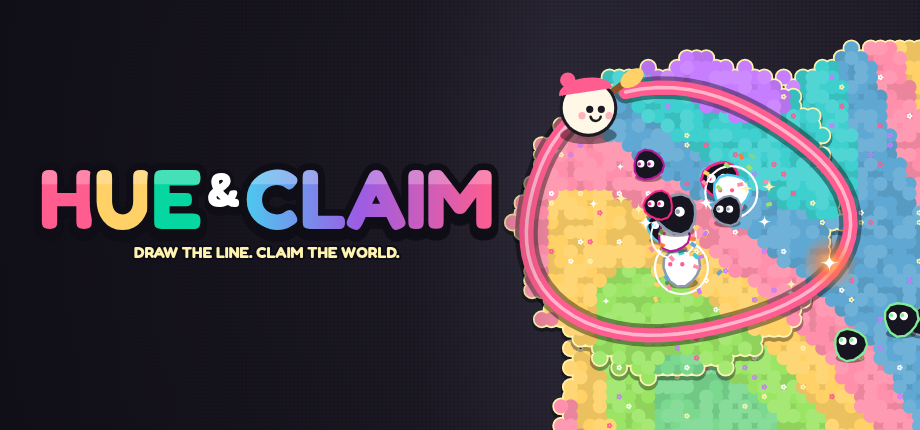

# HUE & CLAIM

**Draw the line. Claim the world.** — a territory-claiming roguelite for Steam.

Leave your land, draw a loop through a world drained of color and come back home: everything inside blooms into color and every monster trapped inside is **captured**. Enemies that touch your line light a **spark** that races along it toward you — make it home first.



## What's in this repository

| Path | Content |
|---|---|
| `src/` | The complete game (TypeScript, Canvas 2D, WebAudio — no engine, no external assets) |
| `src/game/grid.ts` | Territory/trail/loop-claim algorithm (unit-tested) |
| `src/game/game.ts`, `ai.ts`, `weapons.ts` | Stage simulation, enemy & boss AI, weapons |
| `src/game/run.ts`, `meta.ts` | Run build (upgrades, relics) and meta progression (Atelier, Atlas, unlocks, achievements) |
| `src/render/` | Paint-blob territory renderer, entity rendering, HUD |
| `src/ui/` | Menus (title, modes, characters, level-up, Atelier, Atlas, Codex, settings) with gamepad navigation |
| `src/data/` | All content (EN/DE): 4 characters, 10 weapons, 17 passives, 22 relics, 16 enemy types incl. 5 bosses, 5 biomes, 6 anomalies, 14 Atelier upgrades, 36 achievements |
| `electron/` | Desktop shell for Steam (fullscreen, save file for Steam Cloud, steamworks.js achievements) |
| `steam/` | Store page copy (EN/DE), all capsule/library assets, screenshots, achievement icons + metadata, SteamPipe build scripts |
| `docs/` | Market research, game design document, launch plan, trailer storyboard, press kit (German/English) |
| `tools/`, `scripts/` | Procedural key-art & achievement-icon generators, screenshot/playtest/balance automation |
| `tests/` | Vitest unit tests |

## Play it

```bash
npm install
npm run dev          # http://localhost:5173
```

Controls: **WASD / arrows / left stick / hold mouse** to move · **Space / A** dash · **E / right-click / X** special · **Esc / Start** pause.

## Build

```bash
npm run build          # web build → dist/
npm run build:single   # single self-contained HTML → dist-single/index.html (itch.io / web demo)
npm run build:demo     # demo build (ends after the first boss with a wishlist CTA) → dist-demo/
npm run electron       # run the desktop shell against dist/
npm run dist:win       # Windows build for Steam (electron-builder) → release/
npm run dist:linux     # Linux / Steam Deck build → release/
```

Steam upload: fill in the App/Depot IDs in `steam/steamworks/*.vdf` and `steam_appid.txt`, then
`steamcmd +login <user> +run_app_build $(pwd)/steam/steamworks/app_build.vdf +quit`.

## Test & automation

```bash
npm test                                   # unit tests (claim / flood-fill / sliver logic)
npm run typecheck
node scripts/shot.mjs "bot&god" 20 out 3   # autopilot plays; screenshots + stats (needs `npm run dev`)
node scripts/balance.mjs 3 "bot&fast=4"    # non-god balance probe
node scripts/ui-tour.mjs out               # clicks through every menu
node scripts/capsules.mjs                  # re-render all Steam capsules from tools/keyart.html
node scripts/achicons.mjs                  # re-render achievement icons
node scripts/export-achievements.mjs       # achievement metadata for Steamworks
```

Debug URL parameters: `bot`, `god`, `fast=N`, `stage=N`, `biome=id`, `level=N`, `relics=N`, `goal=0.1`, `time=S`, `seed=x`, `varnish=N`, `nohud`, `demo`.

## Documents
- [Marktrecherche & Konzept-Herleitung](docs/01-marktrecherche.md)
- [Game Design Document](docs/02-game-design-document.md)
- [Release- & Marketing-Plan](docs/03-launch-plan.md)
- [Trailer-Storyboard](docs/04-trailer-storyboard.md)
- [Press kit](docs/05-presskit.md)
- [Steam store page (EN)](steam/store-page-en.md) · [Steam-Shopseite (DE)](steam/store-page-de.md)

## License / credits
Game code © the HUE & CLAIM team. Font: [Fredoka](https://fonts.google.com/specimen/Fredoka) (SIL OFL 1.1).
